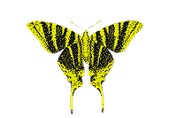

<p align="center">
	
</p>

# Tayri Motion

**Next.js** application dedicated to **blob detection, tracking, and video export**
(zones / objects) in visual sequences, featuring a modern and interactive interface.

## Features

- Blob detection & tracking (dedicated pipeline)
- Interactive control panels (parameters, thresholds, display options)
- Video playback & render export
- Dedicated pages: Home, Live, Tracking, Changelog

## Tech Stack

- **Next.js 16 / React 19**
- **Three.js** (canvas & visualization)
- **Sass / GSAP** (UI & animations)
- **Tweakpane** (controls)
- **ESLint**

## Project Structure

```
src/
 ├─ components/      # UI & controls
 ├─ pages/           # Live, Tracking, Changelog, Legal Notice
 ├─ utils/           # Detection, tracking, video export
 ├─ contexts/        # Thème, loader
 └─ styles/          # Sass
```

## Licence

This project is licensed under the GNU General Public License v3.0.
See the [LICENSE](LICENSE) file for more information.
