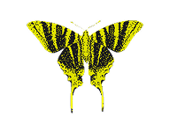

<p align="center">
	
</p>

# Tayri Motion

**Next.js** application for **blob detection, tracking, and video export** in your
videos — upload a clip, tune the detection, style the tracked zones, and export
the result. Everything runs **client-side in the browser** (Canvas 2D +
MediaRecorder); no video ever leaves your machine.

> ⚠️ Desktop only — the app is disabled on screens ≤ 768px.

## Features

### Detection & tracking

- Real-time blob detection (threshold, min size, max blobs) via flood-fill on a Canvas 2D pipeline
- Live editing of every parameter while the video plays
- **Connections** between blobs (edge-to-edge lines, normal / dashed / arrow, curvature, distance limit)

### Styling & effects

- Blob borders: full rectangle or corner-only, custom width & colors
- Fill modes: **none / color / blur / color + blur / zoom**, with opacity control
- Blob labels: coordinates or randomized (numbers / letters / symbols), custom font, size and color

### Timeline segments

- **Range selection** on the timeline — apply tracking only to the parts you choose
- **Editable tracked segments**: each segment keeps its own settings, so editing one never affects the others
- Resize, delete or **re-track** a segment
- Clear **visual feedback**: tracked segments and the current selection are shown as distinct colored bands

### Profiles & export

- **Settings profiles**: save the current configuration, switch instantly, rename, delete — persisted between sessions (localStorage)
- **Export presets** (Low / Medium / High) or a **Custom** mode with fine-grained sliders
- Export to **WebM** or **MP4** with audio, live progress and cancellation
- One-click **reset to defaults** per section

### 3D & experience

- **3D model tracking**: import a **GLB / GLTF / OBJ / STL / FBX** model and track its features live — the blob-detection pipeline runs on the rendered model and boxes/labels follow it as it rotates (orbit camera, PBR lighting, auto-fit, auto-rotate, wireframe), and you can **record the scene + overlay to WebM / MP4**
- Custom video player with a frame-preview scrubbing timeline and volume control
- Zoom & pan on the canvas
- **Live** mode: track blobs directly from your webcam
- Dark / light theme
- Changelog page

## Pages

| Route          | Description                                     |
| -------------- | ----------------------------------------------- |
| `/`            | Landing page                                    |
| `/tracking`    | Main editor: import, track, edit, export        |
| `/tracking-3d` | 3D model tracking (GLB / GLTF / OBJ / STL / FBX) |
| `/live`        | Live webcam blob tracking                        |
| `/changelog`   | Release history                                 |
| `/legal-notice`| Legal notice                                    |

## Getting Started

```bash
# Install dependencies
npm install

# Start the dev server (http://localhost:3000)
npm run dev

# Production build
npm run build
npm run start

# Lint
npm run lint
```

## Tech Stack

- **Next.js 16** (Pages Router) / **React 19**
- **Canvas 2D API** — detection, tracking and rendering pipeline
- **Three.js** — 3D model tracking (WebGL, glTF/OBJ/STL/FBX loaders)
- **MediaRecorder API** — in-browser WebM / MP4 export
- **Sass** (CSS Modules) for styling
- **Framer Motion** — page transitions
- **GSAP** — landing page animations
- **Vercel Analytics**
- **ESLint**

## Project Structure

```
src/
 ├─ components/      # ControlPanel, VideoControls, ViewControls, Loader, …
 ├─ pages/           # Home, Tracking, Live, Changelog, Legal Notice
 ├─ utils/           # blobDetection, blobConnections, videoProcessing, videoExport
 ├─ hooks/           # useParamsDefaults
 ├─ contexts/        # Theme (dark/light), Loader
 ├─ data/            # changelog.json
 └─ styles/          # Sass modules & globals
```

## Licence

This project is licensed under the GNU General Public License v3.0.
See the [LICENSE](LICENSE) file for more information.
